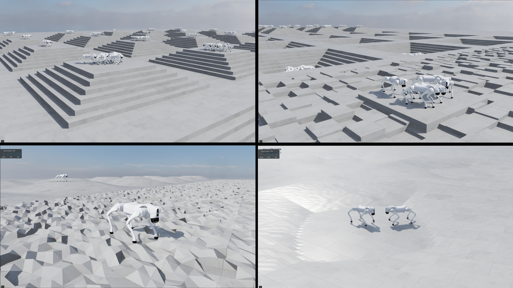
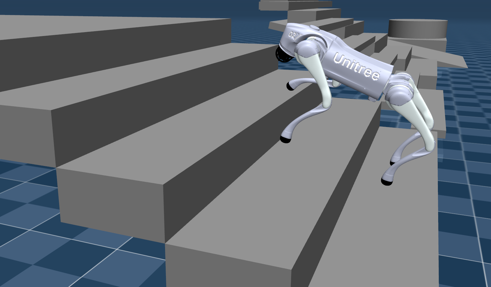

# Unitree Go2 RL

Research framework for reinforcement learning, autonomous locomotion, and sim-to-sim evaluation of the Unitree Go2 quadruped robot.

The project integrates the main components of the experimental stack as Git submodules. The repository is intended to provide a reproducible environment for development, training, evaluation, and analysis of locomotion controllers.

<p align="center">
  
  
</p>

## Project Structure

```text
unitree-go2-rl/
├── IsaacLab/                 # Training simulator and RL environment
├── unitree_rl_lab/           # Reinforcement learning framework and training configurations
├── unitree_mujoco/           # MuJoCo simulation and sim-to-sim evaluation
├── unitree_ros/              # ROS integration
├── unitree_ros2/             # ROS 2 integration
├── unitree_sdk2/             # C++ SDK
├── unitree_sdk2_python/      # Python SDK
└── unitree_metrics/          # Training metrics analysis and visualization
```

## Components

| Component           | Purpose                                             |
| ------------------- | --------------------------------------------------- |
| IsaacLab            | Training simulator and RL environment               |
| unitree_rl_lab      | RL training framework and locomotion configurations |
| unitree_mujoco      | MuJoCo simulation and sim-to-sim evaluation         |
| unitree_ros         | ROS integration                                     |
| unitree_ros2        | ROS 2 integration                                   |
| unitree_sdk2        | C++ SDK for Unitree robots                          |
| unitree_sdk2_python | Python SDK for Unitree robots                       |
| unitree_metrics     | Training metrics analysis and visualization         |

## Repository Organization

The repositories listed above are included as Git submodules.

The main repository records the exact commit of each submodule used by the project. This makes it possible to reproduce a known project state even when the individual component repositories continue to evolve.

The branches specified in `.gitmodules` are used for convenient development and updates, while the commit recorded by the main repository determines the exact version used in a particular revision.

## Cloning

Clone the complete project together with all submodules:

```bash
git clone --recurse-submodules git@github.com:pavelmino44/unitree-go2-rl.git
```

If the repository has already been cloned without submodules:

```bash
git submodule update --init --recursive
```

## Documentation

Detailed setup, usage, and experiment instructions are available in the `docs/` directory.

## Development Status

The project is under active development.

The current stack is focused on:

* reinforcement learning for quadruped locomotion;
* Unitree Go2 velocity control;
* training in IsaacLab;
* sim-to-sim evaluation in MuJoCo;
* ROS 2 and Unitree SDK integration;
* analysis and visualization of training metrics.

Installation and experiment-specific instructions are being documented as the project develops.

## License

This repository integrates multiple independent projects as Git submodules.

Each submodule retains its original license and copyright notices. The applicable licenses are:

* IsaacLab — BSD-3-Clause
* unitree_rl_lab — Apache License 2.0
* unitree_mujoco — BSD-3-Clause
* unitree_ros — BSD-3-Clause
* unitree_ros2 — BSD-3-Clause
* unitree_sdk2 — BSD-3-Clause
* unitree_sdk2_python — BSD-3-Clause
* unitree_metrics — MIT License

Refer to the individual submodule repositories and their `LICENSE` files for the complete license terms.
